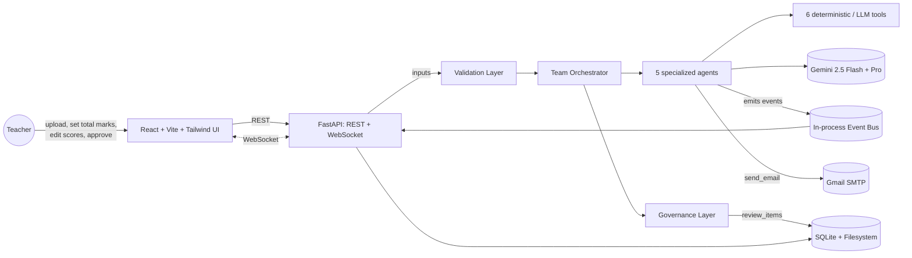
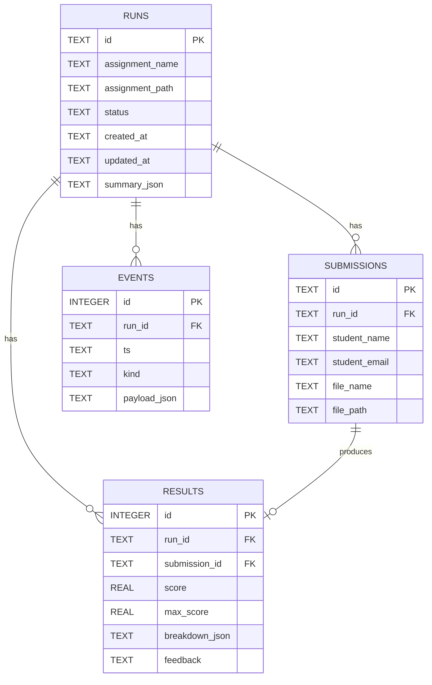
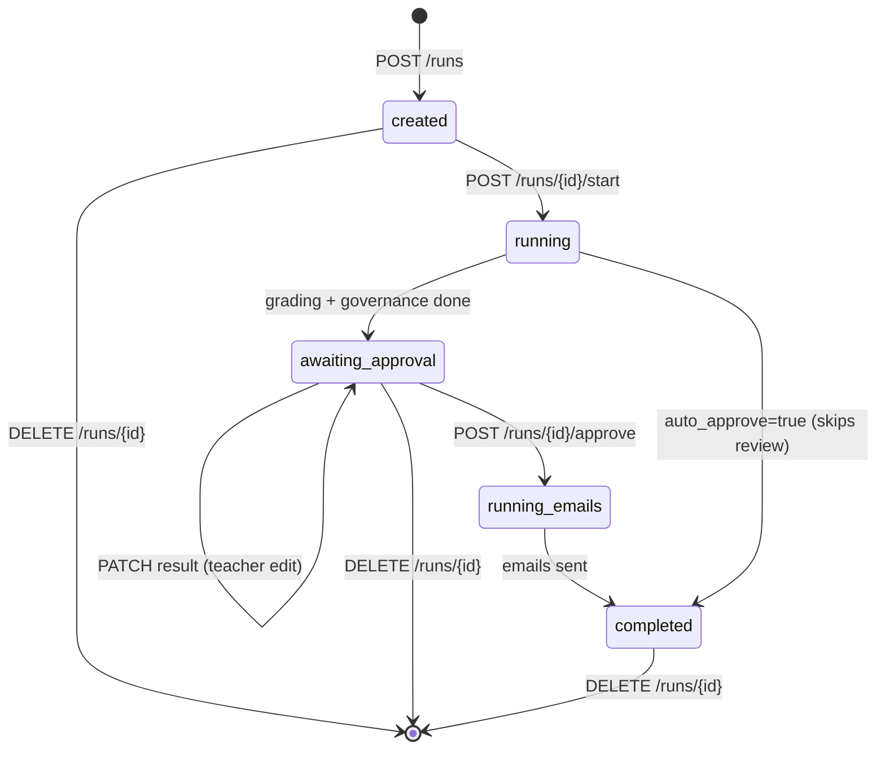
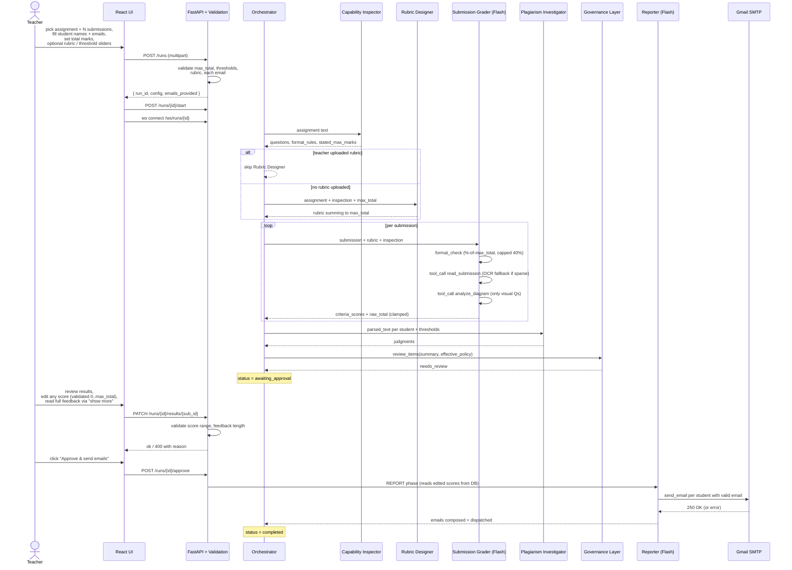

# Evalanime — Technical Design

**Course:** Agentic AI · FAST 8th Sem · **Team:** Psychotic-Coders
**Members:** Ahsan Ali (22K4036) · Muneeb Ur Rehman (22K4025) · Ali Suleman (22K4060)
**Repo:** https://github.com/AhsanAli-exe/EvalAnime-MultiAgent-AI-Grading-System

---

## 1. Executive summary

Evalanime is a small **multi-agent system** that grades student assignments end-to-end. A team of five LLM agents (powered by Google Gemini 2.5 Flash + Pro) collaborates with a library of deterministic tools (parsers, OCR, similarity, format checks, vision) to read each submission, score it, detect plagiarism, write personalized feedback, and email it out. Every decision is streamed live to a dashboard and stored in an immutable audit log.

The pipeline is intentionally **planner-driven**: the system decides *per submission* which tools to call instead of running a fixed pipeline. A formal **Governance / AI-Ethics layer** sits on top, applying confidence thresholds and routing low-confidence decisions to a human-review queue.

The teacher is a first-class actor: they choose the **total marks**, can upload their **own rubric JSON**, can move **similarity thresholds** with sliders, **review and edit every score**, and only then click **Approve & Send Emails**.

### Scope note (important for token budget)
We prioritize **written/text-based assignments** (essays, short answers, definitions, math worked-out in text). Visual content support is intentionally **minimal** because multimodal Gemini calls are very expensive in tokens. The vision tool is a single yes/no "is the required diagram present?" check at low DPI with strict output caps. Hand-drawn diagram grading, scanned PDFs that are mostly images, and figure-heavy assignments are out of scope for this class deliverable. For these we either fall back to OCR (free) or flag to human review.

---

## 2. Goals & non-goals

**Goals**
- Demonstrate every classroom agentic AI concept: planning, tool use, capability awareness, multi-agent coordination, routing/fallback, mixed deterministic + LLM, audit trail, governance.
- Run entirely locally (no cloud, no OAuth, no Docker) so the demo is reproducible on a laptop.
- Cap LLM token spend per run (a full 4-student written run costs around 12-20K tokens, ~$0.02-0.03).
- Be resilient: Gemini Pro outages auto-fall back to Flash so the run never stalls.
- Hand the teacher real controls: total marks, custom rubric, threshold sliders, score edits, approval gate.
- Send actual feedback emails through Gmail SMTP once the teacher approves.

**Non-goals**
- Production multi-tenant SaaS, OAuth verification, CASA security review.
- Sandboxed code execution for programming assignments.
- Vision-heavy grading. We do a single low-DPI yes/no diagram presence check; full figure interpretation is too expensive in tokens for a class budget.
- Hand-drawn diagram grading.

---

## 3. Tech stack

| Layer | Choice | Why |
|---|---|---|
| LLM | Google Gemini 2.5 **Flash** (cheap, fast) + **Pro** (heavy reasoning) via `google-genai` SDK + plain API key | No OAuth / Vertex / ADC needed |
| Backend | Python 3.12 + FastAPI + Uvicorn | Single language for AI + API |
| Storage | SQLite + filesystem | Zero-config, demo-friendly |
| Frontend | React 18 + Vite + Tailwind | Single-page dashboard, live WebSocket |
| OCR | Tesseract (binary) + PyMuPDF (page render) | No Poppler dep |
| Plagiarism | scikit-learn (TF-IDF) + custom 5-gram Jaccard | Deterministic evidence layer |
| Email | `smtplib` + Gmail SMTP (app password) | Real email delivery, with dry-run fallback |

---

## 4. The Agents — Who Does What

Evalanime has **5 specialized LLM agents** plus a thin orchestrator. The orchestrator is *not* an LLM; it's a Python state machine in `team.py`. Below is the full inventory.

### Agent 1 — Capability Inspector
- **File:** `backend/agents/capability_inspector.py`
- **Model:** Gemini 2.5 **Pro** with thinking ON. If Pro returns an empty response (thinking eats the output budget), automatically falls back to **Flash** with thinking off.
- **Input:** raw assignment text (PDF or DOCX, extracted).
- **Output (JSON):** `{questions:[{q_id, text, type:"text"|"visual", risks:[...]}], format_rules:[...], stated_max_marks:<int|null>}`
- **What it does:**
  1. Splits the assignment into questions and labels each as `text` or `visual` so downstream agents know when to invoke vision.
  2. Extracts the **stated total marks** if the assignment document mentions one (e.g., `(2 Marks)` written next to each question). This is later compared against the teacher's input to flag mismatches.
  3. Lists per-question risks ("requires OCR if scanned", "easy to plagiarize", etc.)

### Agent 2 — Rubric Designer
- **File:** `backend/agents/rubric_designer.py`
- **Model:** Gemini 2.5 **Pro** with thinking ON. **Skipped entirely** if the teacher uploaded a `rubric.json`.
- **Input:** assignment text + Inspector's output + the teacher's `max_total`.
- **Output (JSON):** `{max_total, criteria:[{q_id, max, levels:[{label, min_pct, desc}...]}]}` where the criterion `max` values sum to `max_total`.
- **What it does:** Drafts a weighted rubric in strict JSON. If the LLM returns criteria that don't sum to the requested `max_total`, the code **rescales proportionally** so they do. If it returns no criteria at all, a single default criterion is synthesized.

### Agent 3 — Submission Grader (the most agentic one)
- **File:** `backend/agents/submission_grader.py`
- **Model:** Gemini 2.5 **Flash** with `thinking_budget=1024` and `temperature=0.0` (for consistent grades).
- **Tools available (function calling):**
  - `read_submission()` — parses PDF / DOCX (with tables) / ZIP; auto-falls back to OCR for sparse text.
  - `analyze_diagram(question)` — multimodal Flash call at low DPI, capped output, only invoked when the Inspector tagged a question as `visual`.
- **Input:** one student's submission file + the rubric + Inspector output + pre-computed format deductions.
- **Output (JSON):** `{criteria_scores:[{q_id, score, max, level, reason}], raw_total, comments}`
- **What it does:** This is the **planner-driven** agent. Given a file and a rubric, **Flash decides which tools to call and in what order**, not us. For Alice's clean PDF it calls `read_submission` once and is done. For Eve's image-PDF it calls `read_submission`, sees `sparse=true`, the handler auto-routes to OCR. For Frank's no-diagram PDF it calls `read_submission`, then `analyze_diagram`, then scores. Per-criterion scores are clamped to that criterion's `max` after the fact so an LLM that hallucinates score=15 with criterion.max=10 can't break the grade.

### Agent 4 — Plagiarism Investigator
- **File:** `backend/agents/plagiarism_investigator.py`
- **Model:** Gemini 2.5 **Flash**, temperature 0.
- **Input:** parsed text of every student's submission + per-run thresholds.
- **Output (JSON):** `{matrix_ids, cosine, jaccard, flags, judgments:[{a, b, verdict, confidence, reason}]}`
- **What it does:** **Two-layer detection:**
  1. *Deterministic gate (no LLM):* compute_similarity runs TF-IDF cosine and 5-gram Jaccard over every pair. Only pairs that cross both thresholds become "flags."
  2. *LLM judgment (only on flagged pairs):* Flash sees both texts plus the numbers and returns one of `plagiarized`, `paraphrased`, `coincidental`, `unclear` with a confidence score.
  - The governance layer then decides whether the verdict has enough evidence to count.

### Agent 5 — Reporter
- **File:** `backend/agents/reporter.py`
- **Model:** Gemini 2.5 **Flash**, temperature 0.
- **Input:** per-student final score + breakdown + plagiarism note (if relevant).
- **Output:** a 5-8 line plain-text feedback email body per student.
- **What it does:** Composes a personalized, short email. The body is always saved to `data/runs/<id>/emails/<sub_id>.json`. If `EMAIL_DRY_RUN=0` and SMTP credentials are set AND the student has an email, the body is also dispatched through Gmail SMTP. Otherwise it stays as `dry_run` for that student. The subject line is `Your grade for the assignment (<score>/<max_total>)`.

### Orchestrator (not an LLM agent)
- **File:** `backend/agents/team.py`
- A thin Python state machine that runs the 7 phases (INSPECT → DESIGN_RUBRIC → GRADE_EACH → DETECT_PLAGIARISM → GOVERNANCE → AWAITING_APPROVAL → REPORT). It pauses at `awaiting_approval` so the teacher can review and edit before emails go out.

---

## 5. Repository layout

```
Project/
├── backend/
│   ├── main.py                  FastAPI app: REST + WebSocket
│   ├── config.py                env / paths / model names / SMTP settings
│   ├── db.py                    SQLite schema + helpers (incl. update_result, delete_run)
│   ├── storage.py               filesystem + events.jsonl + config/rubric files + purge
│   ├── events_bus.py            in-process pub/sub for the WebSocket
│   ├── governance.py            policy thresholds + review queue (ETHICS LAYER)
│   ├── validation.py            single source of input validation
│   ├── tools/
│   │   ├── parsers.py           parse_pdf, parse_docx (incl. tables), unzip_archive
│   │   ├── ocr.py               ocr_pdf_images (Tesseract + PyMuPDF render)
│   │   ├── format_check.py      percentage-based deductions, scaled by max_total
│   │   ├── similarity.py        TF-IDF cosine + 5-gram Jaccard
│   │   ├── vision.py            Gemini Flash multimodal (low DPI, capped output)
│   │   └── email_tool.py        smtplib (Gmail SMTP) with dry-run mode
│   ├── agents/
│   │   ├── base.py              tool_loop + simple_call + retry + Pro→Flash fallback
│   │   ├── capability_inspector.py
│   │   ├── rubric_designer.py
│   │   ├── submission_grader.py
│   │   ├── plagiarism_investigator.py
│   │   ├── reporter.py
│   │   └── team.py              orchestrator (grading + report split, governance)
│   └── scripts/
│       └── gen_demo.py          generates 6 synthetic students (with subset arg)
├── frontend/
│   └── src/
│       ├── App.jsx              header + sidebar with delete buttons + main pane
│       ├── api.js               fetch + WebSocket helpers (incl. patchResult, deleteRun)
│       └── components/
│           ├── UploadForm.jsx       max_total + rubric upload + thresholds + email validation
│           ├── Dashboard.jsx        phase tracker + mismatch banner + Approve & Send
│           ├── PhaseTracker.jsx
│           ├── EventStream.jsx
│           ├── ResultsTable.jsx     inline Edit + score validation + feedback show more
│           ├── SimilarityPanel.jsx
│           ├── EmailsPanel.jsx      sent / dry_run / failed badges + counts
│           ├── RubricPanel.jsx
│           └── ReviewPanel.jsx      governance human-review queue
├── data/                        runtime data (gitignored)
├── scripts/
│   ├── tools_smoke.py           exercise every tool against demo
│   ├── agents_smoke.py          run the full agent team without the API
│   ├── validation_smoke.py      51 zero-LLM unit tests
│   ├── teacher_features_smoke.py rubric upload + thresholds + approval flow
│   ├── http_features_smoke.py   HTTP API end-to-end (PATCH/approve/delete)
│   ├── real_docx_smoke.py       regression test with a real .docx assignment
│   └── email_smoke.py           direct Gmail SMTP test
├── .env                         GEMINI_API_KEY + SMTP creds (gitignored)
├── Project Proposal - Evalanime - Psychotic-Coders.docx
├── Project Report - Evalanime - Psychotic-Coders.docx
└── TECHNICAL-DESIGN.md          this file
```

---

## 6. High-level architecture



---

## 7. Data model

### SQLite schema (ERD)



### Per-run filesystem layout

```
data/runs/<run_id>/
├── config.json          per-run config (max_total, thresholds, auto_approve)
├── rubric.json          teacher-uploaded rubric (if any) - skips Rubric Designer
├── events.jsonl         append-only audit log
├── summary.json         final summary (rubric, results, plagiarism, governance)
└── emails/<sub_id>.json generated email bodies (always saved, even when sent)
```

### Run status state machine



---

## 8. End-to-end sequence (teacher review mode)



---

## 9. Per-submission grader (the agentic core)

```mermaid
flowchart TD
    A[grade_submission] --> B[deterministic format_check<br/>%-of-max_total, 40% cap]
    B --> C[start Flash tool-loop<br/>thinking_budget=1024, temp=0.0]
    C --> D{model picks tool}
    D -->|read_submission| E[parse_pdf / parse_docx_with_tables / unzip<br/>auto OCR fallback if sparse]
    E --> D
    D -->|analyze_diagram| F[Gemini multimodal at low DPI<br/>capped output - only visual Qs]
    F --> D
    D -->|no more tool calls| G[final JSON:<br/>criteria_scores + raw_total + comments]
    G --> H[clamp per-criterion score to criterion.max<br/>clamp raw_total to max_total]
    H --> I[final_total = clamp&#40;raw_total - format_total, 0, max_total&#41;]
    I --> J[insert into results table + emit event]
```



### Consistency tuning
Earlier runs produced different scores for two students with very similar answers (e.g., Asad 12/12 and Zeeshan 11/12 on near-identical content). That was pure LLM stochasticity. We fixed it with:
- `temperature = 0.0` (was 0.1) → deterministic sampling
- `thinking_budget = 1024` on Flash for the grader (was 0) → reasoning before answering
- `max_output = 1500` (was 700) → room for thinking + JSON without truncation

Result: identical inputs now produce identical (or near-identical) grades. Costs ~500-1000 extra thinking tokens per student. For a 4-student run that's ~$0.005 extra. Negligible.

---

## 10. Tool inventory

| Tool | File | LLM cost | Used by |
|---|---|---|---|
| `parse_any` (pdf/docx-with-tables/zip + OCR fallback) | `tools/parsers.py` + `tools/ocr.py` | 0 | Grader |
| `check_format` (%-of-max_total deductions, 40% cap) | `tools/format_check.py` | 0 | Grader (deterministic pre-step) |
| `compute_similarity` (TF-IDF + 5-gram Jaccard) | `tools/similarity.py` | 0 | Plagiarism Investigator |
| `analyze_visual` | `tools/vision.py` | 1 Flash call w/ image (low DPI, capped) | Grader (only for visual Qs) |
| `send_email` | `tools/email_tool.py` | 0 | Reporter |

Every tool call emits `tool_call_start` + `tool_call_end` events — visible live in the UI.

---

## 11. Teacher controls

The teacher has six explicit levers, all wired through the UI:

| Lever | UI location | Backend storage | Effect |
|---|---|---|---|
| **Total marks** | UploadForm: number input (1-200, default 30) | `config.json.max_total` | Rubric Designer produces criteria summing to this. Every score input capped. Email subjects show `<score>/<max_total>`. |
| **Custom rubric** | UploadForm: optional `.json` file | `data/runs/<id>/rubric.json` | If present, Rubric Designer is skipped entirely. |
| **Similarity thresholds** | UploadForm: 3 sliders (cosine, jaccard, min LLM confidence) | `config.json` | Plagiarism Investigator + Governance use these. |
| **Per-student email** | UploadForm: email field per student row with live validation + status hint | `submissions.student_email` | If valid: real Gmail goes out. If empty: saved as dry_run for that student. |
| **Score edits** | Dashboard: Edit button per row, inline validator | `PATCH /runs/{id}/results/{sub_id}` | Override any AI score before emails. Validated `0 <= score <= max_total`, feedback under 4000 chars. |
| **Approve gate** | Dashboard: "Approve & send emails" button | `POST /runs/{id}/approve` | Emails only dispatched after teacher clicks Approve. |
| **Delete run** | Sidebar: trash button on hover | `DELETE /runs/{id}` | Cleans up DB rows + filesystem (`data/runs/<id>`, `data/uploads/<id>`, `data/assignments/<id>`). |

The status machine in §7 enforces this: edits are only accepted while `status=awaiting_approval`; approval transitions to `running_emails` → `completed`.

---

## 12. Input validation layer

All inputs flow through `backend/validation.py` (single source of truth). The validation is applied in **three layers (defence in depth):**

| Layer | What it catches |
|---|---|
| **Frontend** (`UploadForm.jsx`, `ResultsTable.jsx`) | Live red border + per-row error message + disabled Save button. Email column shows green "will be sent" / amber "will be saved" / red "not a valid email" per row plus a footer count summary. Feedback char counter. |
| **API handlers** (`main.py`) | `POST /runs` rejects: bad `max_total`, malformed rubric JSON, empty submission files, malformed emails (per-row). Clamps thresholds to [0, 1]. `PATCH /runs/{id}/results/{sub_id}` rejects: score out of [0, max_score], NaN/inf, non-string feedback, too-long feedback, edits on non-`awaiting_approval` runs. Returns HTTP 400 with clear `detail` message. |
| **Submission grader** (`submission_grader.py`) | LLM-output guard: per-criterion scores clamped to that criterion's `max`, totals clamped to `[0, max_total]`. Stops an LLM that says score=15 when criterion.max=10. |

### Validators (centralized)

```python
validate_max_total(value, default=30)      # int in [1, 200]
clamp_threshold(value, field, default)     # clamp to [0, 1]
validate_score(value, max_total)           # number in [0, max_total], rejects NaN/inf
validate_feedback(value)                   # str under FEEDBACK_MAX_CHARS (4000)
validate_rubric(obj)                       # dict with non-empty criteria, max_total inferred if missing
validate_email(value, allow_empty=True)    # length 5-254, exactly one @, has TLD, no spaces
clamp_criterion_score(value, criterion_max)# defensive against LLM hallucination
```

**51 unit tests** in `scripts/validation_smoke.py` exercise every validator (boundary cases, NaN/inf, garbage strings, oversize feedback, malformed rubrics, malformed emails, edge addresses). Zero LLM calls, runs in <1 second.

---

## 13. AI Ethics / Governance Layer

In agentic systems "ethics" rarely means a separate moral reasoning model. It means a **governance layer that constrains and audits the autonomous agents**. Evalanime's `backend/governance.py` is exactly that.

### 13.1 Effective policy (defaults + per-run overrides)

```python
POLICY = {
    "min_plagiarism_confidence": 0.75,    # below -> "needs review", not accusation
    "min_rubric_criteria": 1,             # rubric must contain at least 1 criterion
    "min_grading_text_chars": 40,         # below -> flag for review
    "max_zero_score_questions": 2,        # too many zeros -> flag for review
    "plagiarism_confirmed": {             # all three needed to confirm an accusation
        "cosine_min": 0.5,
        "jaccard_min": 0.15,
        "verdicts": ["plagiarized", "paraphrased"],
    },
}
```

The teacher's per-run thresholds (from sliders) overlay on top of `POLICY` in `team._effective_policy()`. Original `POLICY` is never mutated, and every run records the exact policy used.

### 13.2 Ethics principles (encoded **and** displayed in the UI)

| # | Principle | Implementation in code |
|---|---|---|
| 1 | **Transparency** | every prompt / tool call / retry / fallback / token count goes to `events.jsonl` + sqlite |
| 2 | **Human oversight** | pipeline stops at `awaiting_approval`; teacher reviews + edits; `governance.review_items()` builds the queue; UI shows it in `ReviewPanel.jsx` |
| 3 | **Two-layer plagiarism** | deterministic similarity is REQUIRED evidence; LLM verdict alone never accuses |
| 4 | **Determinism where it matters** | format compliance is computed by regex (scaled by `max_total`); grader uses `temperature=0` for repeatability |
| 5 | **Honesty constraint** | every grader/judge prompt explicitly forbids inventing answers the student didn't write |
| 6 | **Cost responsibility** | thinking budgets capped, output tokens capped, image DPI lowered before vision calls, Pro auto-falls-back to Flash to avoid stalls, written-only scope |
| 7 | **Contestability** | the full audit log is exportable so a contested grade can be re-walked event by event |
| 8 | **Privacy** | data stays on the local machine + SQLite; only the parsed text of an individual submission is sent to Gemini |

### 13.3 Governance flow

```mermaid
flowchart LR
    R[End of grading phase] --> G[governance.review_items&#40;summary, effective_policy&#41;]
    G --> C0{teacher max_total<br/>!= assignment stated marks?}
    G --> C1{rubric criteria<br/>< min_rubric_criteria?}
    G --> C2{text extracted<br/>< min_grading_text_chars?}
    G --> C3{# zero-score Qs<br/>> max_zero_score_questions?}
    G --> C4{plagiarism<br/>verdict?}
    C0 -->|yes| FLAG[needs review]
    C1 -->|yes| FLAG
    C2 -->|yes| FLAG
    C3 -->|yes| FLAG
    C4 -->|verdict + confidence < min_confidence| FLAG
    C4 -->|verdict + cosine/jaccard below floor| FLAG
    FLAG --> LOG[append governance_review event]
    LOG --> UI[ReviewPanel + Mismatch Banner]
    UI --> TEACHER[teacher reviews + edits + approves]
```



### 13.4 Total-marks mismatch detection (new)

The Inspector now also extracts `stated_max_marks` if the assignment document mentions a total. The orchestrator and governance layer compare it to the teacher's input. If they differ, a red **⚠ Total marks mismatch** banner appears at the top of the dashboard and an item enters the human-review queue. The teacher is never blocked, just informed.

---

## 14. Agentic AI concepts (explicit mapping)

| Concept | Where in code | What you see in the UI |
|---|---|---|
| **Planning** | `team.py` (pipeline) + `submission_grader.py` (per-submission tool selection) | 7-phase tracker; per-submission tool calls in live trace |
| **Tool use (function calling)** | `agents/base.py:tool_loop()`, `submission_grader.TOOL_DECLS` | `agent_tool_call` events |
| **Capability awareness** | Inspector classifies questions; grader prompt receives `visual_qs` | Vision tool fires only on visual questions |
| **Multi-agent coordination** | 5 specialized agents share `run_id` + state via orchestrator | Each agent name in `phase_step` events |
| **Routing / fallback** | OCR auto-fallback for sparse PDFs; Pro→Flash on 503; Inspector→Flash on empty Pro response; governance routes low-confidence to human review | `llm_retry`, `llm_model_fallback`, `inspector_empty_response` events |
| **Mixed deterministic + LLM** | format_check, similarity = pure-Python; rubric, grading, plagiarism verdict, email body = LLM | Deductions for bad-format submissions cost 0 tokens |
| **State / memory** | SQLite + events.jsonl + per-run config.json + rubric.json | summary.json snapshot reproducible from events.jsonl |
| **Audit trail** | `storage.append_event()` → events.jsonl + sqlite + pub/sub | Live trace panel, expandable JSON per event |
| **Robustness** | retry + Pro→Flash fallback; per-criterion clamping; format deductions capped at 40% of max_total; temperature=0 for grading | System never wipes a student to 0 from format alone |
| **Governance** | `backend/governance.py` evaluates the run summary | ReviewPanel + policy/principles toggle + mismatch banner |
| **Human-in-the-loop** | Run stops at `awaiting_approval`; PATCH + approve endpoints | Edit buttons; "Approve & send emails" button |

---

## 15. Audit-trail event taxonomy

Every event has `{ ts, kind, payload }`. The full list:

| Kind | Emitted by | Purpose |
|---|---|---|
| `run_created` / `submission_added` / `submission_rejected` | API | upload acknowledged or rejected (empty file) |
| `run_config` / `rubric_uploaded` / `rubric_upload_error` | API | per-run config + optional rubric provenance |
| `run_start_requested` / `run_approved` / `run_deleted` | API | teacher actions |
| `phase` | orchestrator | INSPECT / DESIGN_RUBRIC / GRADE_EACH / DETECT_PLAGIARISM / GOVERNANCE / AWAITING_APPROVAL / REPORT / DONE |
| `phase_step` | each agent | start/end of one agent step + key payload |
| `agent_start` / `agent_end` | tool_loop | bracket an agentic tool-calling loop |
| `agent_tool_call` | tool_loop | the LLM chose to call tool X with args Y |
| `tool_call_start` / `tool_call_end` | each tool | the deterministic side of a call |
| `llm_call` / `llm_response` | base.py | one round-trip to Gemini (prompt size + reply preview) |
| `llm_usage` | base.py | exact input_tokens + output_tokens for the call |
| `llm_retry` | base.py | a transient 5xx happened and was backed-off |
| `llm_model_fallback` | base.py | primary model (Pro) exhausted → switching to Flash |
| `llm_retry_exhausted` | base.py | all retries failed on the last model in the chain |
| `inspector_empty_response` | inspector | Pro returned empty, falling back to Flash |
| `max_marks_mismatch` | orchestrator | teacher's max_total != assignment's stated_max_marks |
| `result_edited` | API | teacher overrode a score / feedback via PATCH |
| `governance_review` | governance.py | the final policy evaluation with review_items |
| `run_error` | API | uncaught exception in the background runner |

---

## 16. REST + WebSocket API

| Method | Path | Body / Params | Returns |
|---|---|---|---|
| `GET` | `/health` | – | `{ok, gemini_key_loaded}` |
| `POST` | `/runs` | multipart: `assignment`, `submissions[]`, `student_names`, `student_emails`, optional `rubric_json`, `max_total`, `cosine_threshold`, `jaccard_threshold`, `min_plagiarism_confidence`, `auto_approve` | `{run_id, submission_ids[], config, rubric_uploaded, emails_provided}` · **400** on invalid inputs |
| `GET` | `/runs` | – | list of runs |
| `GET` | `/runs/{id}` | – | `{run, submissions, results}` |
| `GET` | `/runs/{id}/events` | – | full audit-log events |
| `POST` | `/runs/{id}/start` | – | kicks the GRADING phase (stops at `awaiting_approval`) |
| `PATCH` | `/runs/{id}/results/{sub_id}` | JSON: `{score?, feedback?}` | `{ok, changed, score, max_total}` · **400** on invalid edits |
| `POST` | `/runs/{id}/approve` | – | kicks the REPORT phase (sends emails) · **400** if status != `awaiting_approval` |
| `DELETE` | `/runs/{id}` | – | cascades through DB + filesystem · **400** if run is currently running |
| `GET` | `/runs/{id}/summary` | – | the final `summary.json` (or `null`) |
| `WS` | `/ws/runs/{id}` | – | replays history → live-streams new events → `ping` every 5s |

---

## 17. How to run

```bash
# 1) backend deps (Python 3.12+)
cd "Project"
python -m pip install -r backend/requirements.txt

# 2) put GEMINI_API_KEY in .env (already done; .env is gitignored)
# Optional: add SMTP_USER, SMTP_APP_PASSWORD, EMAIL_DRY_RUN=0 for real emails

# 3) generate demo data (6 synthetic students)
python -m backend.scripts.gen_demo

# 4) backend (from PROJECT ROOT, NOT from inside backend/)
python -m uvicorn backend.main:app --host 127.0.0.1 --port 8000

# 5) frontend (separate terminal)
cd frontend
npm install
npm run dev
# open http://localhost:5173

# 6) demo path inside the UI
#    * click "+ New run"
#    * pick assignment file (PDF or DOCX)
#    * pick student submission files
#    * fill in student names AND emails (live validation per row)
#    * set Total marks (matches what the assignment document says)
#    * optional: "+ Show advanced" for rubric upload or threshold sliders
#    * leave "Auto-send emails" UNCHECKED so the pipeline stops for your review
#    * click "Create run"
#    * watch the 7 phase chips light up + live agent trace + scores fill in
#    * click "show more" on any feedback to read it in full
#    * click "Edit" on any row to override (validated 0..max_total)
#    * click "Approve & send emails" to dispatch the reporter
#    * delete unwanted past runs via the trash icon in the sidebar
```

### Real email mode
In `.env`:
```
EMAIL_DRY_RUN=0
SMTP_HOST=smtp.gmail.com
SMTP_PORT=587
SMTP_USER=your-gmail@gmail.com
SMTP_APP_PASSWORD=your-16-char-app-password
```
Generate the app password at https://myaccount.google.com/apppasswords (requires 2-Step Verification on the Google account).

---

## 18. Reproducibility & verification

Seven scripts run the whole stack without the UI:

```bash
# Zero-LLM unit tests (fast, ~1s):
python scripts/validation_smoke.py            # 51 validator tests

# Full pipeline (with LLM, configurable subset):
python scripts/tools_smoke.py                 # exercises every tool against demo
python scripts/agents_smoke.py 3              # full agent team on 3 students (~30s)
python scripts/teacher_features_smoke.py 3    # rubric upload + thresholds + edit + approve
python scripts/real_docx_smoke.py             # regression: real .docx assignment

# HTTP (requires uvicorn running):
python scripts/http_features_smoke.py         # PATCH validation + edit-and-approve

# Direct SMTP test:
python scripts/email_smoke.py                 # sends one real email per recipient
```

A typical 4-student written run uses **~15-20K tokens** (~$0.02-0.03 with Gemini 2.5):
- 1× capability_inspector (Pro w/ thinking, Flash if Pro busy)
- 1× rubric_designer (Pro w/ thinking, Flash if Pro busy) — skipped if teacher uploaded a rubric
- ~3-5 Flash calls × N students for grading (with thinking_budget=1024 for consistency)
- 1× plagiarism judgment per flagged pair (Flash)
- 1× reporter (Flash) × N students

Note: vision calls add significantly to token cost. The system avoids them whenever possible.

### Note on Gemini Pro availability
Gemini 2.5 Pro is in heavy demand at times and returns `503 UNAVAILABLE` ("This model is currently experiencing high demand"). Our retry + Pro→Flash fallback handles this. If the run errors during a 503 storm, just wait 2-5 minutes and try again. The dashboard's `run_error` event will show the exact 503 response from Google.

---

## 19. Future work

- Hosted SaaS pending Google OAuth verification + CASA security review.
- Vision-based grading of hand-drawn diagrams (currently yes/no presence check only).
- Code-execution sandbox for programming assignments.
- Cross-semester plagiarism corpus.
- Teacher-configurable format rules (allowed extensions, page caps, required headers) via the UI.
- Web search tool for fact-checking student answers.
- A red-team agent that adversarially probes grading decisions before finalization.
- Bulk email retry from the dashboard for failed SMTP attempts.

---

*End of document.*
