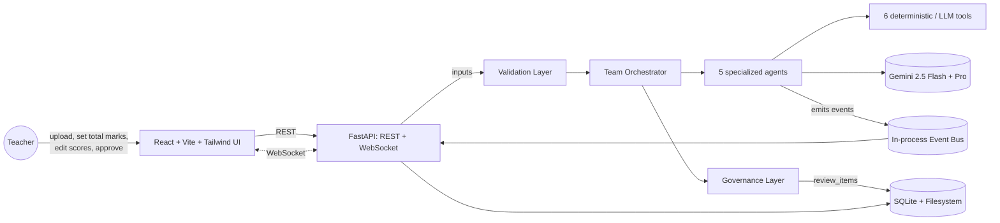
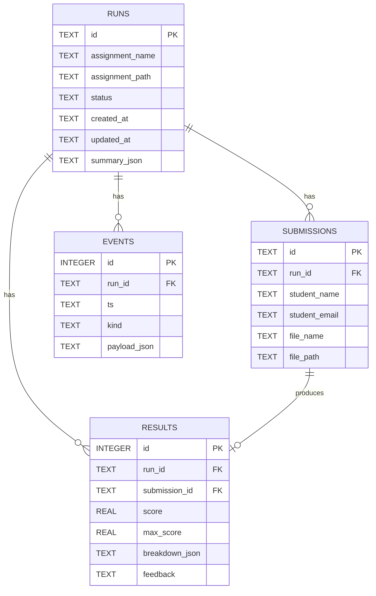
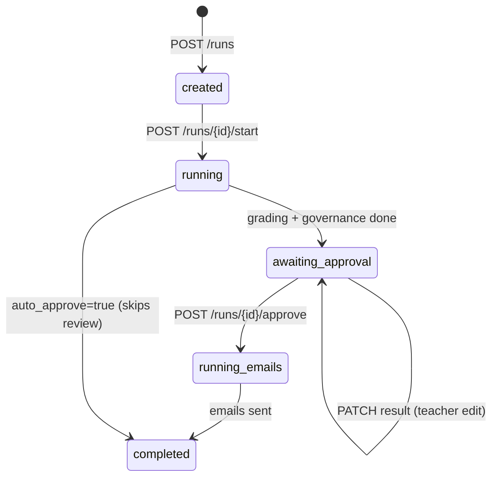
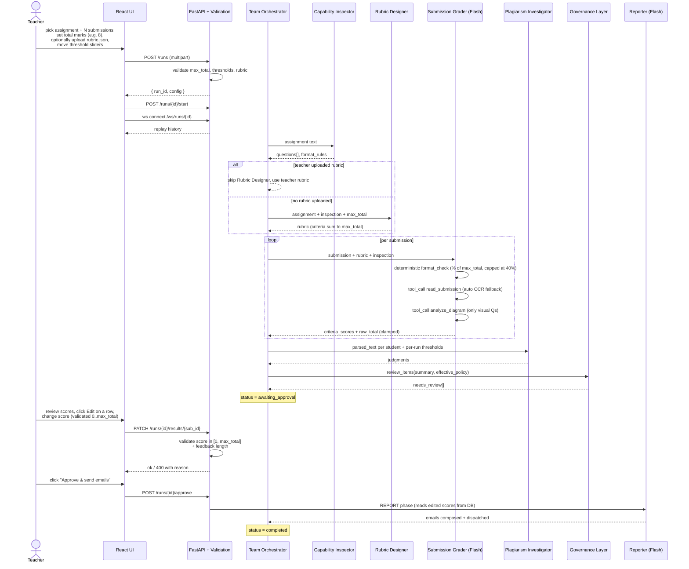

# Evalanime — Technical Design

**Course:** Agentic AI · FAST 8th Sem · **Team:** Psychotic-Coders
**Members:** Ahsan Ali (22K4036) · Muneeb Ur Rehman (22K4025) · Ali Suleman (22K4060)

---

## 1. Executive summary

Evalanime is a small **multi-agent system** that grades student assignments end-to-end. A team of LLM agents (powered by Google Gemini 2.5 Flash + Pro) collaborates with a library of deterministic tools (parsers, OCR, similarity, format checks, vision) to read each submission, score it, detect plagiarism, write personalized feedback, and email it out. Every decision is streamed live to a dashboard and stored in an immutable audit log.

The pipeline is intentionally **planner-driven**: the system decides *per submission* which tools to call instead of running a fixed pipeline. A formal **Governance / AI-Ethics layer** sits on top, applying confidence thresholds and routing low-confidence decisions to a human-review queue.

The teacher is a first-class actor: they choose the **total marks**, can upload their **own rubric JSON**, can move **similarity thresholds** with sliders, **review and edit every score**, and only then click **Approve & Send Emails**. The autonomous agents do the heavy lifting; the teacher keeps the final say.

---

## 2. Goals & non-goals

**Goals**
- Demonstrate every classroom agentic AI concept: planning, tool use, capability awareness, multi-agent coordination, routing/fallback, mixed deterministic + LLM, audit trail, governance.
- Run entirely locally (no cloud, no OAuth, no Docker) so the demo is reproducible on a laptop.
- Cap LLM token spend per run (~25K tokens per 6-student run, ~$0.04).
- Be resilient: Gemini Pro outages auto-fall back to Flash so the run never stalls.
- Hand the teacher real controls: total marks, custom rubric, threshold sliders, score edits, approval gate.

**Non-goals**
- Production multi-tenant SaaS, OAuth verification, CASA security review.
- Sandboxed code execution for programming assignments.
- Hand-drawn diagram grading (basic vision only).

---

## 3. Tech stack

| Layer | Choice | Why |
|---|---|---|
| LLM | Google Gemini 2.5 **Flash** (cheap, fast) + **Pro** (heavy reasoning) via `google-genai` SDK + plain API key | No OAuth / Vertex / ADC needed |
| Backend | Python 3.12 + FastAPI + Uvicorn | Single language for AI + API |
| Storage | SQLite + filesystem | Zero-config, demo-friendly |
| Frontend | React 18 + Vite + Tailwind | Single-page dashboard, live WebSocket |
| OCR | Tesseract (binary) + PyMuPDF (page render) | No Poppler dep |
| Plagiarism | scikit-learn (TF-IDF) + custom 5-gram Jaccard | Deterministic evidence layer |
| Email | `smtplib` + Gmail SMTP (app password) | Optional, defaults to dry-run |

---

## 4. Repository layout

```
Project/
├── backend/
│   ├── main.py                  FastAPI app: REST + WebSocket
│   ├── config.py                env / paths / model names
│   ├── db.py                    SQLite schema + helpers (incl. update_result)
│   ├── storage.py               filesystem + events.jsonl + config/rubric files
│   ├── events_bus.py            in-process pub/sub for the WebSocket
│   ├── governance.py            policy thresholds + review queue (ETHICS LAYER)
│   ├── validation.py            single source of input validation
│   ├── tools/
│   │   ├── parsers.py           parse_pdf, parse_docx (incl. tables), unzip_archive
│   │   ├── ocr.py               ocr_pdf_images (Tesseract)
│   │   ├── format_check.py      percentage-based deductions scaled by max_total
│   │   ├── similarity.py        TF-IDF cosine + 5-gram Jaccard
│   │   ├── vision.py            Gemini 2.5 multimodal
│   │   └── email_tool.py        smtplib (with dry-run mode)
│   ├── agents/
│   │   ├── base.py              tool_loop + simple_call + retry + Pro→Flash fallback
│   │   ├── capability_inspector.py  (Pro, fallback Flash)
│   │   ├── rubric_designer.py       (Pro, fallback Flash, defensive normalization)
│   │   ├── submission_grader.py     (Flash, tool-calling, per-criterion clamping)
│   │   ├── plagiarism_investigator.py (Flash, accepts per-run thresholds)
│   │   ├── reporter.py              (Flash, uses dynamic max_score in emails)
│   │   └── team.py              orchestrator (grading + report split, governance)
│   └── scripts/
│       └── gen_demo.py          generates 6 synthetic students (subset arg)
├── frontend/
│   └── src/
│       ├── App.jsx              header + sidebar + main pane
│       ├── api.js               fetch + WebSocket helpers
│       └── components/
│           ├── UploadForm.jsx       max_total + rubric upload + threshold sliders
│           ├── Dashboard.jsx        phase tracker + Approve & Send button
│           ├── PhaseTracker.jsx
│           ├── EventStream.jsx
│           ├── ResultsTable.jsx     inline Edit per row + live validation
│           ├── SimilarityPanel.jsx
│           ├── EmailsPanel.jsx
│           ├── RubricPanel.jsx
│           └── ReviewPanel.jsx      governance human-review queue
├── data/                        runtime data (sqlite, uploads, runs, demo files)
├── scripts/
│   ├── tools_smoke.py           exercise every tool against the demo
│   ├── agents_smoke.py          run the full agent team without the API
│   ├── validation_smoke.py      38 zero-LLM unit tests for validators
│   ├── teacher_features_smoke.py rubric upload + thresholds + approval flow
│   ├── http_features_smoke.py   end-to-end via real HTTP incl. PATCH/approve
│   └── real_docx_smoke.py       regression test using a real .docx assignment
├── .env                         GEMINI_API_KEY etc. (gitignored)
└── TECHNICAL-DESIGN.md          this file
```

---

## 5. High-level architecture



---

## 6. Data model

### SQLite schema (ERD)



### Per-run filesystem layout

```
data/runs/<run_id>/
├── config.json          per-run config (max_total, thresholds, auto_approve)
├── rubric.json          teacher-uploaded rubric (if any) - skips Rubric Designer
├── events.jsonl         append-only audit log
├── summary.json         final summary (rubric, results, plagiarism, governance)
└── emails/<sub_id>.json generated email bodies
```

### Run status state machine



---

## 7. End-to-end sequence (one run, teacher review mode)



---

## 8. Per-submission grader (the agentic core)

The grader is the most "agentic" part. Tools are exposed to Gemini Flash via function calling; the model decides *what to call and in what order* for each submission. **Format compliance is computed deterministically before the LLM ever runs** so the LLM is told "format deductions are already applied — do NOT add any."

```mermaid
flowchart TD
    A[grade_submission] --> B[deterministic format_check<br/>uses max_total -> percentages]
    B --> C[start Flash tool-loop<br/>system: do NOT add format deductions]
    C --> D{model picks tool}
    D -->|read_submission| E[parse_pdf / parse_docx_with_tables / unzip<br/>auto OCR fallback if sparse]
    E --> D
    D -->|analyze_diagram| F[Gemini multimodal vision]
    F --> D
    D -->|no more tool calls| G[final JSON:<br/>criteria_scores + raw_total + comments]
    G --> H[clamp per-criterion score to criterion.max<br/>clamp raw_total to max_total]
    H --> I[final_total = clamp&#40;raw_total - format_total, 0, max_total&#41;]
    I --> J[insert into results table + emit event]
```



The 6 demo students each take a different path through this graph:

| Student | File | Path taken |
|---|---|---|
| Alice | clean PDF | `read_submission` → final (no vision) |
| Bob | DOCX | format check accepts (.docx allowed) → `read_submission` → final |
| Charlie | paraphrased PDF | `read_submission` → final (flagged later by plagiarism) |
| Diana | ZIP | `read_submission` auto-unzips + picks nested PDF → final |
| Eve | image-PDF | `read_submission` parser sees sparse → auto OCR fallback → final |
| Frank | partial PDF, no diagram | `read_submission` → `analyze_diagram` → vision returns NO → final |

---

## 9. Agent inventory + resilience

| Agent | Primary | Fallback | Job | Token cost (approx) |
|---|---|---|---|---|
| Capability Inspector | 2.5 Pro (thinking on) | **2.5 Flash** | Classify each question text/visual + risks | ~600 in / ~400 out |
| Rubric Designer | 2.5 Pro (thinking on) | **2.5 Flash** | Draft a weighted rubric in strict JSON summing to `max_total` | ~250 in / ~750 out |
| Submission Grader | 2.5 Flash (thinking off) | — | Per-submission tool-calling loop → JSON grade | ~2000 in / ~600 out × N |
| Plagiarism Investigator | 2.5 Flash (thinking off) | — | LLM verdict only on similarity-flagged pairs | ~600 in / ~150 out × pairs |
| Reporter | 2.5 Flash (thinking off) | — | Compose ~140-word feedback email per student | ~600 in / ~250 out × N |

### Pro → Flash automatic fallback

```mermaid
flowchart LR
    A[Agent calls generate_content&#40;model=Pro&#41;] --> B[try once]
    B -->|2xx| OK[done]
    B -->|429/500/502/503/504| R1[retry 2s]
    R1 -->|2xx| OK
    R1 -->|fail| R2[retry 4s]
    R2 -->|2xx| OK
    R2 -->|fail| F[llm_model_fallback event<br/>switch to Flash]
    F --> B2[try once]
    B2 -->|2xx| OK
    B2 -->|fail| R3[retry 2s -> retry 4s]
    R3 -->|fail| FAIL[raise]
```



- Up to **2 attempts on Pro** with 2s + 4s backoff (6s total).
- If still failing, log `llm_model_fallback` and try **2 attempts on Flash**.
- Worst-case wait before the run either succeeds or surfaces a clear error: ~12 seconds, instead of indefinite stall on a Pro outage.

---

## 10. Tool inventory

| Tool | File | LLM cost | Used by |
|---|---|---|---|
| `parse_any` (pdf/docx-with-tables/zip + OCR fallback) | `tools/parsers.py` + `tools/ocr.py` | 0 | Grader |
| `check_format` (%-of-max_total deductions, 40% cap) | `tools/format_check.py` | 0 | Grader (deterministic pre-step) |
| `compute_similarity` (TF-IDF + 5-gram Jaccard) | `tools/similarity.py` | 0 | Plagiarism Investigator |
| `analyze_visual` | `tools/vision.py` | 1 Flash call w/ image | Grader (only for visual Qs) |
| `send_email` | `tools/email_tool.py` | 0 | Reporter |

Every tool call emits `tool_call_start` + `tool_call_end` events — visible live in the UI.

---

## 11. Teacher controls

The teacher has four explicit levers, all wired through the UI:

| Lever | UI location | Backend storage | Effect |
|---|---|---|---|
| **Total marks** | UploadForm: number input (1–200, default 30) | `config.json.max_total` | Rubric Designer is told to produce criteria summing to this. Every score input is capped to it. Email subjects show `<score>/<max_total>`. |
| **Custom rubric** | UploadForm: optional `.json` file | `data/runs/<id>/rubric.json` | If present, the Rubric Designer agent is **skipped entirely** — saves a Pro call. Rubric is validated, `max_total` is inferred from criteria if missing. |
| **Similarity thresholds** | UploadForm: 3 sliders (cosine, jaccard, min LLM confidence) | `config.json` | Plagiarism Investigator uses these to decide what counts as a flag. Governance uses `min_plagiarism_confidence` to decide what counts as an accusation. |
| **Score edits + Approve gate** | Dashboard: Edit per row, "Approve & Send Emails" button | `PATCH /runs/{id}/results/{sub_id}`, `POST /runs/{id}/approve` | Run stops at `awaiting_approval` after grading. Teacher can override any score (validated). Emails are only dispatched after explicit approval. |

The status machine in §6 enforces this: edits are only accepted while `status=awaiting_approval`; approval transitions to `running_emails` → `completed`.

---

## 12. Input validation layer

All inputs flow through `backend/validation.py` (single source of truth). The validation is applied in **three layers (defence in depth):**

| Layer | What it catches |
|---|---|
| **Frontend** (`UploadForm.jsx`, `ResultsTable.jsx`) | live red border + error message + disabled Save button when score < 0, > max, NaN, or feedback over 4000 chars. Visual feedback only. |
| **API handlers** (`main.py`) | `POST /runs` rejects: bad `max_total`, malformed rubric JSON, empty submission files. Clamps thresholds to [0, 1]. `PATCH /runs/{id}/results/{sub_id}` rejects: score out of [0, max_score], NaN/inf, non-string feedback, too-long feedback, edits on non-`awaiting_approval` runs. Returns HTTP 400 with clear `detail` message. |
| **Submission grader** (`submission_grader.py`) | LLM-output guard: per-criterion scores clamped to that criterion's `max`, totals clamped to `[0, max_total]`. Stops an LLM that says score=15 when criterion.max=10. |

### Validators (centralized)

```python
validate_max_total(value, default=30)      # int in [1, 200]
clamp_threshold(value, field, default)     # clamp to [0, 1]
validate_score(value, max_total)           # number in [0, max_total], rejects NaN/inf
validate_feedback(value)                   # str under FEEDBACK_MAX_CHARS (4000)
validate_rubric(obj)                       # dict with non-empty criteria, max_total inferred if missing
clamp_criterion_score(value, criterion_max)# defensive against LLM hallucination
```

38 unit tests in `scripts/validation_smoke.py` exercise every validator (boundary cases, NaN/inf, garbage strings, oversize feedback, malformed rubrics). Zero LLM calls, runs in <1 second.

---

## 13. AI Ethics / Governance Layer

In agentic systems "ethics" rarely means a separate moral reasoning model — it means a **governance layer that constrains and audits the autonomous agents**. Evalanime's `backend/governance.py` is exactly that.

### 13.1 Effective policy (defaults + per-run overrides)

```python
POLICY = {
    "min_plagiarism_confidence": 0.75,    # below -> "needs review", not accusation
    "min_rubric_criteria": 1,             # rubric must contain at least 1 criterion
    "min_grading_text_chars": 40,         # below -> flag for review
    "max_zero_score_questions": 2,        # too many zeros -> flag for review
    "plagiarism_confirmed": {             # all three needed to confirm an accusation
        "cosine_min": 0.5,
        "jaccard_min": 0.15,
        "verdicts": ["plagiarized", "paraphrased"],
    },
}
```

The teacher's per-run thresholds (from sliders) overlay on top of `POLICY` in `team._effective_policy()` — original `POLICY` is never mutated, every run records the exact policy used.

### 13.2 Ethics principles (encoded **and** displayed in the UI)

| # | Principle | Implementation in code |
|---|---|---|
| 1 | **Transparency** | every prompt / tool call / retry / fallback / token count goes to `events.jsonl` + sqlite |
| 2 | **Human oversight** | pipeline stops at `awaiting_approval`; teacher reviews + edits; `governance.review_items()` builds the queue; UI shows it in `ReviewPanel.jsx` |
| 3 | **Two-layer plagiarism** | deterministic similarity is REQUIRED evidence; LLM verdict alone never accuses |
| 4 | **Determinism where it matters** | format compliance is computed by regex (scaled by `max_total`), not the LLM; pre-applied before grading |
| 5 | **Honesty constraint** | every grader/judge prompt explicitly forbids inventing answers the student didn't write |
| 6 | **Cost responsibility** | thinking budgets capped, output tokens capped, image DPI lowered before vision calls, Pro auto-falls-back to Flash to avoid stalls |
| 7 | **Contestability** | the full audit log is exportable so a contested grade can be re-walked event by event |
| 8 | **Privacy** | data stays on the local machine + SQLite; only the parsed text of an individual submission is sent to Gemini |

### 13.3 Governance flow

```mermaid
flowchart LR
    R[End of grading phase] --> G[governance.review_items&#40;summary, effective_policy&#41;]
    G --> C1{rubric criteria<br/>< min_rubric_criteria?}
    G --> C2{text extracted<br/>< min_grading_text_chars?}
    G --> C3{# zero-score Qs<br/>> max_zero_score_questions?}
    G --> C4{plagiarism<br/>verdict?}
    C1 -->|yes| FLAG[needs review]
    C2 -->|yes| FLAG
    C3 -->|yes| FLAG
    C4 -->|verdict + confidence < min_plagiarism_confidence| FLAG
    C4 -->|verdict + cosine/jaccard below floor| FLAG
    FLAG --> LOG[append governance_review event]
    LOG --> UI[ReviewPanel + AWAITING_APPROVAL banner]
    UI --> TEACHER[teacher reviews + edits + approves]
```



Empty queue = **all autonomous decisions met the policy thresholds**. A non-empty queue is itself a form of model honesty: "I'm not confident enough about these, please look."

---

## 14. Agentic AI concepts (explicit mapping)

| Concept | Where in code | What you see in the UI |
|---|---|---|
| **Planning** | `backend/agents/team.py` (high-level pipeline) + `backend/agents/submission_grader.py` (per-submission tool selection) | The 7-phase tracker turns amber → green; per-submission tool calls appear in live trace |
| **Tool use (function calling)** | `agents/base.py:tool_loop()`, `submission_grader.TOOL_DECLS` | `agent_tool_call` events in the trace |
| **Capability awareness** | `capability_inspector.py` classifies each question as `text` or `visual`; grader's user prompt receives `visual_qs` so vision is only called when appropriate | Vision tool fires only for questions classified as visual |
| **Multi-agent coordination** | 5 specialized agents share a `run_id` and a state passed by the orchestrator | Each agent name appears in `phase_step` events |
| **Routing / fallback** | `read_submission` handler auto-routes sparse PDFs to OCR; grader can call `analyze_diagram` on visual Qs; `_generate_with_retry` auto-falls back from Pro to Flash on 503; governance routes low-confidence items to human review | Eve's submission shows `parse_pdf → sparse=true → ocr_pdf_images`; `llm_model_fallback` event when Pro is busy |
| **Mixed deterministic + LLM** | Format check (% of max_total), similarity (TF-IDF + Jaccard) are pure-Python; rubric, grading, plagiarism verdict, email body are LLM | Deductions for bad-format submissions don't cost any tokens |
| **State / memory** | Per-run state lives in SQLite + events.jsonl + per-run `config.json` + per-run `rubric.json` + per-tool-loop in-memory dict | The summary.json snapshot is reproducible from events.jsonl |
| **Audit trail** | `storage.append_event()` writes to events.jsonl + sqlite + pub/sub | Live trace panel; click any row to expand the full prompt/response payload |
| **Robustness** | `_generate_with_retry()` exp. backoff + auto Pro→Flash fallback; tools return `{ok:false, error}` rather than throwing; submission_grader clamps LLM hallucinated scores | `llm_retry` + `llm_model_fallback` events; format deductions capped at 40% of max_total so they never wipe a student to 0 |
| **Governance** | `backend/governance.py` evaluates the run summary against `POLICY` thresholds (with teacher overrides) | "Governance · human review queue" panel + policy/principles toggle |
| **Human-in-the-loop** | Run stops at `awaiting_approval`; `PATCH /runs/{id}/results/{sub_id}`; `POST /runs/{id}/approve` | Edit buttons enabled while awaiting approval; emails only sent after teacher clicks Approve |

---

## 15. Audit-trail event taxonomy

Every event has `{ ts, kind, payload }`. The kinds the UI knows about:

| Kind | Emitted by | Purpose |
|---|---|---|
| `run_created` / `submission_added` / `submission_rejected` | API | upload acknowledged or rejected (empty file) |
| `run_config` / `rubric_uploaded` / `rubric_upload_error` | API | per-run config + optional rubric provenance |
| `run_start_requested` / `run_approved` | API | teacher actions: start grading, approve emails |
| `phase` | team orchestrator | INSPECT / DESIGN_RUBRIC / GRADE_EACH / DETECT_PLAGIARISM / GOVERNANCE / AWAITING_APPROVAL / REPORT / DONE |
| `phase_step` | each agent | start/end of one agent step + key payload |
| `agent_start` / `agent_end` | tool_loop | bracket an agentic tool-calling loop |
| `agent_tool_call` | tool_loop | the LLM chose to call tool X with args Y |
| `tool_call_start` / `tool_call_end` | each tool | the deterministic side of a call (chars / pages / ok flag) |
| `llm_call` / `llm_response` | base.py | one round-trip to Gemini (prompt size + reply preview) |
| `llm_usage` | base.py | exact input_tokens + output_tokens for the call |
| `llm_retry` | base.py | a transient 5xx happened and was backed-off |
| `llm_model_fallback` | base.py | primary model (Pro) exhausted → switching to Flash |
| `llm_retry_exhausted` | base.py | all retries failed on the last model in the chain |
| `result_edited` | API | teacher overrode a score / feedback via PATCH |
| `governance_review` | governance.py | the final policy evaluation with review_items |
| `run_error` | API | uncaught exception in the background runner |

---

## 16. REST + WebSocket API

| Method | Path | Body / Params | Returns |
|---|---|---|---|
| `GET` | `/health` | – | `{ok, gemini_key_loaded}` |
| `POST` | `/runs` | multipart: `assignment`, `submissions[]`, `student_names` (CSV), `student_emails` (CSV), optional `rubric_json`, `max_total`, `cosine_threshold`, `jaccard_threshold`, `min_plagiarism_confidence`, `auto_approve` | `{run_id, submission_ids[], config, rubric_uploaded}` · **400** on invalid max_total / rubric / empty submissions |
| `GET` | `/runs` | – | list of runs |
| `GET` | `/runs/{id}` | – | `{run, submissions, results}` |
| `GET` | `/runs/{id}/events` | – | full audit-log events |
| `POST` | `/runs/{id}/start` | – | kicks the GRADING phase in a background task (stops at `awaiting_approval` unless `auto_approve=true`) |
| `PATCH` | `/runs/{id}/results/{sub_id}` | JSON: `{score?, feedback?}` | `{ok, changed, score, max_total}` · **400** on out-of-range score, NaN, too-long feedback, or run not in `awaiting_approval` |
| `POST` | `/runs/{id}/approve` | – | kicks the REPORT phase (sends emails using teacher-edited scores) · **400** if status != `awaiting_approval` |
| `GET` | `/runs/{id}/summary` | – | the final `summary.json` (or `null`) |
| `WS` | `/ws/runs/{id}` | – | replays history → live-streams new events → `ping` every 5s |

---

## 17. How to run

```bash
# 1) backend deps (Python 3.12+)
cd "Project"
python -m pip install -r backend/requirements.txt

# 2) put GEMINI_API_KEY in .env (already done; .env is gitignored)

# 3) generate demo data (6 synthetic students)
python -m backend.scripts.gen_demo

# 4) backend (from PROJECT ROOT, not from inside backend/)
python -m uvicorn backend.main:app --host 127.0.0.1 --port 8000

# 5) frontend (separate terminal)
cd frontend
npm install
npm run dev
# open http://localhost:5173

# 6) demo path inside the UI
#    * click "+ New run"
#    * pick assignment file (PDF or DOCX)
#    * pick all student submission files
#    * set Total marks (e.g. 8 for a small assignment, 30 for a big one)
#    * optionally: click "+ Show advanced" to upload a rubric JSON or tune sliders
#    * leave "Auto-send emails" UNCHECKED so the pipeline stops for your review
#    * click "Create run"
#    * watch the 7 phase chips light up + live agent trace + scores fill in
#    * click "Edit" on any row to override a score (validated 0..max_total)
#    * click "Approve & send emails" to dispatch the reporter
```

To enable **real** email sending instead of dry-run, in `.env`:
```
EMAIL_DRY_RUN=0
SMTP_USER=youraddress@gmail.com
SMTP_APP_PASSWORD=your-16-char-app-password
```

---

## 18. Reproducibility & verification

Six scripts run the whole stack without the UI:

```bash
# Zero-LLM unit tests (fast, ~1s):
python scripts/validation_smoke.py            # 38 validator tests

# Full pipeline (with LLM, configurable subset):
python scripts/tools_smoke.py                 # exercises every tool against demo
python scripts/agents_smoke.py 3              # run full agent team on 3 students
python scripts/teacher_features_smoke.py 3    # rubric upload + thresholds + edit + approve
python scripts/real_docx_smoke.py             # regression: real .docx assignment

# HTTP (requires uvicorn running):
python scripts/http_features_smoke.py         # PATCH validation + edit-and-approve over HTTP
```

A typical 3-student run uses **~12K tokens** (~$0.02 with Gemini 2.5):
- 1× capability_inspector (Pro w/ thinking, Flash if Pro busy)
- 1× rubric_designer (Pro w/ thinking, Flash if Pro busy) — skipped if teacher uploaded a rubric
- ~3–5 Flash calls × N students for grading
- 1× plagiarism judgment per flagged pair (Flash)
- 1× reporter (Flash) × N students
- 1× vision (Flash, image input) when the inspector classified a question as visual

---

## 19. Future work

- Hosted SaaS pending Google OAuth verification + CASA security review.
- Vision-based grading of hand-drawn diagrams (currently yes/no presence check only).
- Code-execution sandbox for programming assignments.
- Cross-semester plagiarism corpus.
- Teacher-configurable format rules (allowed extensions, page caps, required headers) via the UI.
- Web search tool for fact-checking student answers (with citation requirement before the agent can use a claim).
- A red-team agent that adversarially probes the grading agent's decisions before they are finalized.

---

*End of document.*
